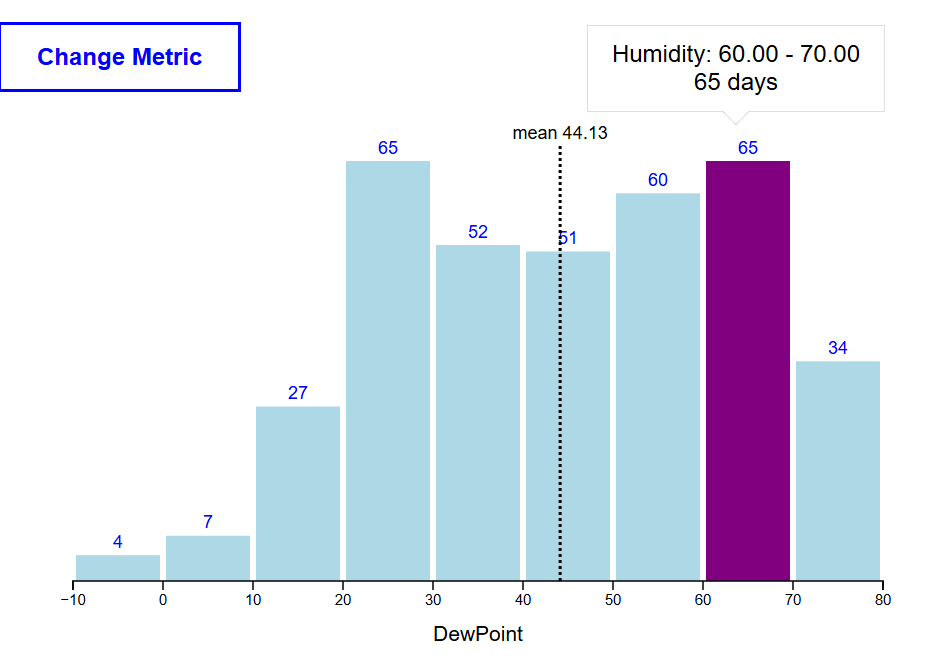

# Interactive Weather Data Histogram

An interactive histogram built with **D3.js** that visualizes weather data distributions with smooth animations.

---

## 📸 Preview

## 📸 Preview



---

## Features

- Histogram visualization of weather metrics (humidity, temperature, wind speed, UV index and more)
- Animated bar, mean line, and mean label transitions when switching metrics
- Interactive tooltip on hover showing value range and day count
- "Change Metric" button to cycle through all available weather variables

---

## Tech Stack

- **D3.js v7** — data binding, scales, axes, SVG rendering and transitions
- **HTML5 / CSS3 / JavaScript (ES6+)**

---

## Project Structure

```
project/
├── index.html
├── js/
│   └── script.js
└── Data/
    └── my_weather_data.json
```
